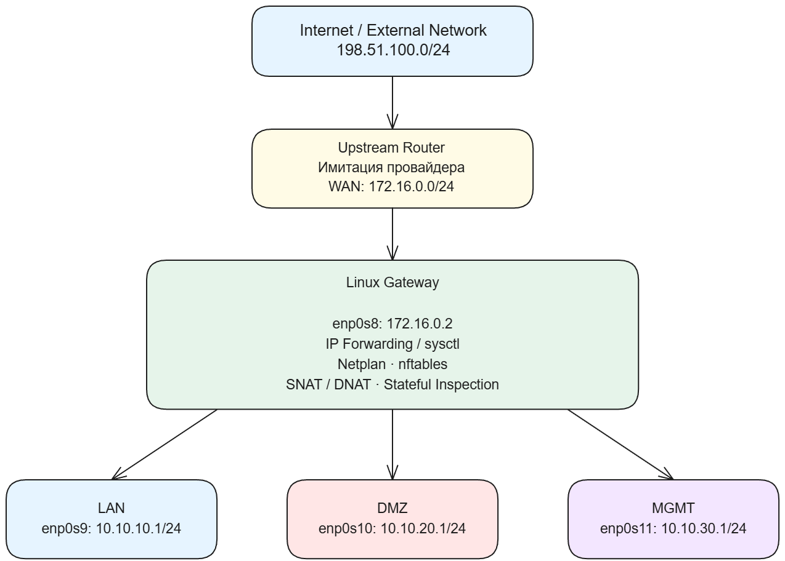
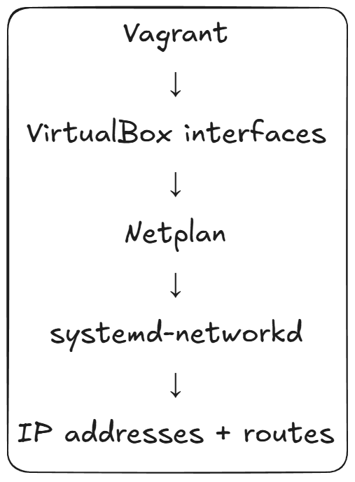
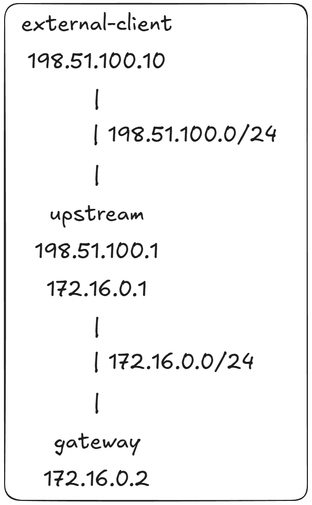

# Network Tools Practice
Создаю изолированный сетевой стенд из нескольких Linux-машин: WAN, LAN, DMZ, MGMT и внешнего клиента, связанный через Linux-шлюз.

На практике настраиваю маршрутизацию и firewall с помощью Netplan, nftables и iptables, а затем проверяю работу сети и диагностирую трафик с помощью ip, ss, tcpdump, conntrack и других инструментов.

## Некоторые схемы работы:

